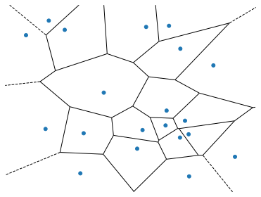

# Vector Pictures for Data Analysis Course

## Overview

Set of programs/scripts for generating vector image, that will be used in
lectures presentations.

[List for all pictures, that probable will be vectorized](https://docs.google.com/spreadsheets/d/14owTcCgBI9dgRV3bD8-PJtoFbX9sbjvmffwWbo2j-S4/edit?usp=sharing)

## Generation instructions

In order to build all images run

```sh
make
```

Images will be placed in `out/` folder

## Vectorized Pictures List

### Voronoi diagram


