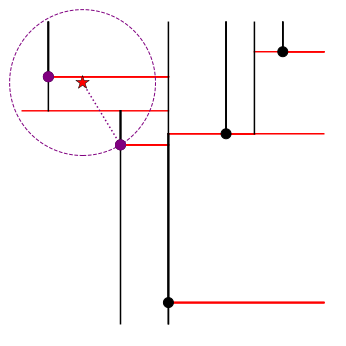
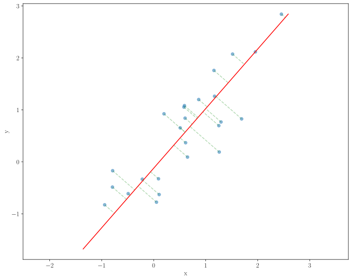
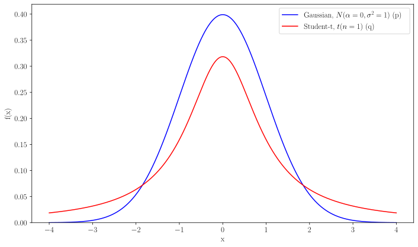

# Vector Pictures for Data Analysis Course

## Overview

Set of programs/scripts for generating vector image, that will be used in
lectures presentations.

[List for all pictures, that probable will be vectorized](https://docs.google.com/spreadsheets/d/14owTcCgBI9dgRV3bD8-PJtoFbX9sbjvmffwWbo2j-S4/edit?usp=sharing)

## Generation instructions

In order to regenerate all images run

```sh
make
```

Images will be placed in `out/` folder.

*Note:* Some scripts requires latex installation. In order to install it on 
Ubuntu (tested on Ubuntu 24.04), run:

```sh
sudo apt-get install \
  texlive \
  texlive-latex-extra \
  texlive-fonts-recommended \
  cm-super
```

## Vectorized Pictures List

### Splitting into Groups for Cross-Validation


### Voronoi diagram


### kD-Tree



### Hat Loss Function


### Bayes Dividing Surface


### Decision Trees Comparison by Max Depth


### PCA 2D



### Distributions, used in t-SNE


